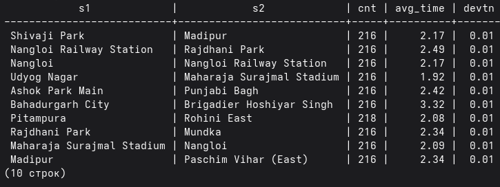
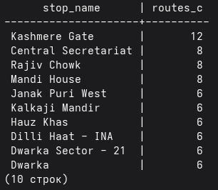
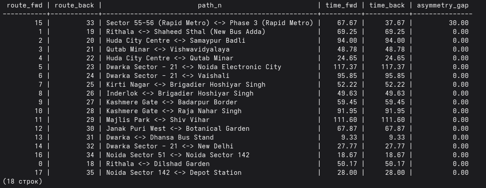

# Теоретическая задача "Автобусы"

> Все задачи были решены с помощью SQL-запросов в psql. Использован датасет https://www.kaggle.com/datasets/lyxbash/bus-transit-data

[Open Transit Data - Bus](https://www.kaggle.com/datasets/lyxbash/bus-transit-data)

### 1. Подготовка данных

#### buses

https://raw.githubusercontent.com/badmaev93/DB\_buses/refs/heads/main/%D0%94%D0%B0%D0%BD%D0%BD%D1%8B%D0%B5/buses.csv

5438 автобусов на 36 маршрутах

#### bus\_routes

https://raw.githubusercontent.com/badmaev93/DB\_buses/refs/heads/main/%D0%94%D0%B0%D0%BD%D0%BD%D1%8B%D0%B5/bus\_routes.csv


#### bus\_stops

https://raw.githubusercontent.com/badmaev93/DB\_buses/refs/heads/main/%D0%94%D0%B0%D0%BD%D0%BD%D1%8B%D0%B5/bus\_stops.csv

262 остановки, 128434 отрезков между остановками, 1 автобус объезжает до 50 остановок. Автобусы ходят с 04:45 до 01:13.

### 2. Подготовка БД

Создание базы данных, подключение к ней и создание таблиц в соответствии с csv файлами.

### 3. Приведение к условиям задачи

Минимальный интервал между остановками всех автобусов составляет 1,66, максиамльный - 12,34.

По условиям задачи, время не должно превышать 5 минут. Удаление автобусов, где есть остановки, не соответсующие условию.

```
DELETE FROM bus_stops
WHERE bus_id IN (
    SELECT DISTINCT bus_id
    FROM (
        SELECT 
            bus_id,
            arr_time - LAG(arr_time) OVER (PARTITION BY bus_id ORDER BY stop_order) as tr_time
        FROM 
            bus_stops
    ) calc
    WHERE tr_time > 5
);
```

теперь максимальный интервал составляет 4,4 мин.

### 4. Решение 1

По времени отправления автобусов видно, что на маршрут они выходят "волнами", т.е. запускаются несколько автобусов с небольшим интервалом относительно друг друга, затем следует перерыв на несколько часов, затем запускается следующая "волна" автобусов.

```
WITH waves AS (
    SELECT 
        bus_id,
        SUM(CASE WHEN dep_time - prev_dep > 20 OR prev_dep IS NULL THEN 1 ELSE 0 END) 
        OVER (PARTITION BY route_id ORDER BY dep_time) as wave_id
    FROM (
        SELECT bus_id, route_id, dep_time, 
               LAG(dep_time) OVER (PARTITION BY route_id ORDER BY dep_time) as prev_dep 
        FROM bus_routes
    ) t
),
gaps AS (
    SELECT 
        s.bus_id, s.route_id, w.wave_id,
        s.arr_time - LAG(s.arr_time) OVER win as cur_wait,
        LEAD(s.arr_time) OVER win - LAG(s.arr_time) OVER win as fut_gap
    FROM bus_stops s
    JOIN waves w ON s.bus_id = w.bus_id
    WINDOW win AS (PARTITION BY s.route_id, s.stop_order, w.wave_id ORDER BY s.arr_time)
)
SELECT 
    wave_id, route_id, bus_id,
    MAX(cur_wait) as cur_max,
    MAX(fut_gap) as fut_max
FROM gaps
WHERE fut_gap IS NOT NULL
GROUP BY 1, 2, 3  
HAVING MAX(fut_gap) < 6
ORDER BY 1, 5; 
```

В результате, найдено 397 автобусов на 2-ух маршрутах, после удаление которых, время между автобусами на каждой остановке будет относительно небольшим (5,74 мин вместо 2,87).


### 5. Решение 2\*

Нестабильные участки

```
SELECT 
    s1, 
    s2, 
    COUNT(*) as cnt,
    ROUND(AVG(dur), 2) as avg_time,
    ROUND(STDDEV(dur), 2) as devtn
FROM (
    SELECT 
        stop_name as s1,
        LEAD(stop_name) OVER (PARTITION BY bus_id ORDER BY stop_order) as s2,
        LEAD(arr_time) OVER (PARTITION BY bus_id ORDER BY stop_order) - arr_time as dur
    FROM bus_stops
) t
WHERE s2 IS NOT NULL AND dur > 0
GROUP BY 1, 2
HAVING COUNT(*) > 5
ORDER BY devtn DESC
LIMIT 10;
```



Крупные узлы

```
SELECT stop_name, COUNT(DISTINCT route_id) as routes_c
FROM bus_stops
GROUP BY stop_name
ORDER BY routes_c DESC
LIMIT 10;
```



Ассиметрия 

```
WITH bus_dur AS (
    SELECT 
        bus_id,
        route_id,
        (MAX(arr_time) - MIN(arr_time)) as s_tr_dur
    FROM bus_stops
    GROUP BY bus_id, route_id
),
route_stats AS (
    SELECT 
        route_id,
        (ARRAY_AGG(stop_name ORDER BY stop_order ASC))[1] as start_n,
        (ARRAY_AGG(stop_name ORDER BY stop_order DESC))[1] as end_n,
        AVG(s_tr_dur) as avg_dur
    FROM bus_stops
    JOIN bus_dur USING (bus_id, route_id)
    GROUP BY route_id
)
SELECT 
    r1.route_id as route_fwd,
    r2.route_id as route_back,
    
    r1.start_n || ' <-> ' || r1.end_n as path_n,
    
    ROUND(r1.avg_dur, 2) as time_fwd,
    ROUND(r2.avg_dur, 2) as time_back,
    
    ROUND(ABS(r1.avg_dur - r2.avg_dur), 2) as asymmetry_gap
FROM route_stats r1
JOIN route_stats r2 
    ON r1.start_n = r2.end_n 
    AND r1.end_n = r2.start_n
WHERE 
    r1.route_id < r2.route_id
    AND r1.start_n != r1.end_n
ORDER BY 
    asymmetry_gap DESC;
```



Почти что для всех путей в предоставленных данных - идеальная симметрия пути между остановками туда и обратно, что в реальности бывает довльно редко, нужно учитывать это при составлении расписания. 

В случае с ассиметричным путем - в одном из направлений на данном участке движение сильно затруднено.

